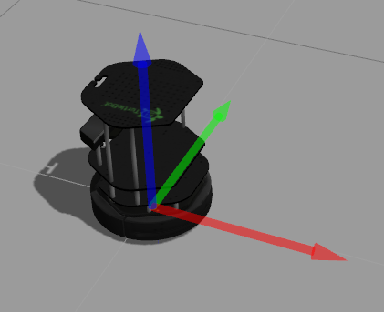

## Setting up your local ros workspace
**I will assume these standard names for workspace and packages. Please amend the commands where necessary if your workspace or package is called differently.**

* Create a workspace if you don't have one yet:
  ```
  mkdir -p ~/catkin_ws/src; cd ~/catkin_ws/src; catkin_init_workspace .;
  ```
* Create a package _assuming dependencies suitable for the first workshop task_:
  ```
  catkin_create_pkg commanding_velocity rospy std_msgs geometry_msgs
  ```
* Create a scripts directory for your first python ROS node:
  ```
  mkdir ~/catkin_ws/src/commanding_velocity/scripts
  ```
* Build the workspace for the first time

  ```
  cd ~/catkin_ws
  catkin_make
  ```

You can see that catkin created a lot of the infrastructure ROS needs to function so you don't have to worry about that any further (for now). The only thing that you have to keep in mind is that **you have to source an environment file every time you open a new terminal**:
```
source ~/catkin_ws/devel/setup.bash
```

## Starting to code
If you are not working on the robot you do need a `roscore` running on your machine:
  ```
  roscore
  ```

Everything will be done in python and spyder. To ensure that spyder knows about ROS, please do not start it from the icon in the short cut panel but from a terminal:
```
source ~/catkin_ws/devel/setup.bash
spyder
```
* Create a new file `Ctrl + N` and save it `Ctrl + S` in `catkin_ws/src/commanding_velocity/scripts` as `command_velocity.py`
* Make the script executable: `chmod a+x ~/catkin_ws/src/commanding_velocity/scripts/command_velocity.py` _only has to be done once_

### Simple "Hello World!"
A simple hello world programme could look like this:
```python
#!/usr/bin/env python
# -*- coding: utf-8 -*-

import rospy


# Creating a custom class
class CommandVelocity():
    """Driving my robot
    """

    # This function is called when a new instance of the class is created
    def __init__(self):
        rospy.loginfo("Hello World")  # Using the ROS logger to print something

# main function
if __name__ == '__main__':
    # This has to be called before any other call to rospy
    rospy.init_node("command_velocity")  # command_velocity is the default name of the node
    cv = CommandVelocity()  # Createing an instance of above class
    rospy.spin()  # Keeping ROS alive until it catches a Ctrl + C

```
If you put this into the just create `command_velocity.py` and save it you are able to run it with:
```
source ~/catkin_ws/devel/setup.bash
rosrun commanding_velocity command_velocity.py
```

### Sending commands to the robots wheels
Building on the simple hello world example:
```python
#!/usr/bin/env python
# -*- coding: utf-8 -*-

import rospy
from geometry_msgs.msg import Twist # This is the message type the robot uses for velocities


class CommandVelocity():
    """Driving my robot
    """

    def __init__(self):
        rospy.loginfo("Starting node")
        self.pub = rospy.Publisher("...", Twist) # Creating a publisher
        
    # A function to send velocities until the node is killed
    def send_velocities(self):
        r = rospy.Rate(10) # Setting a rate (hz) at which to publish
        while not rospy.is_shutdown(): # Runnin until killed
            rospy.loginfo("Sending commands")
            twist_msg = Twist() # Creating a new message to send to the robot
            ...
            self.pub.publish(twist_msg) # Sending the message via our publisher
            r.sleep() # Calling sleep to ensure the rate we set above

if __name__ == '__main__':
    rospy.init_node("command_velocity")
    cv = CommandVelocity()
    cv.send_velocities() # Calling the function
    rospy.spin()
```

A `Twist` message has two parts that are important:
* `Twist.linear`: this has x,y,z components for which you can specify the speed in m/s. Please don't go beyond 0.6
* `Twist.angular`: this also has x,y,z components and determines how quick the robot should rotate around one of the axes in radians/s. Please don't go beyond PI.
To determine which axis you want to move along and turn arounf, please have a look at the picture below:



_Red: x, green: y, blue: z_